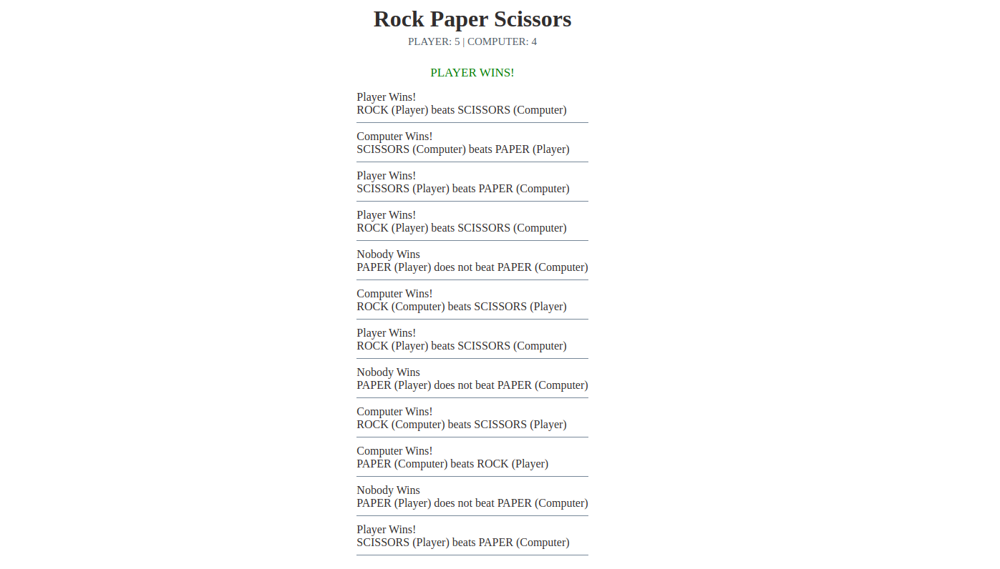

# Rock Paper Scissors



This website implements the popular "Rock Paper Scissors" game against the computer and it is the submission for [The Odin Project: Rock Paper Scissors](https://www.theodinproject.com/lessons/foundations-rock-paper-scissors).


## Live Demo

[Rock Paper Scissors](https://jesusgraterol.github.io/rock-paper-scissors-top/src/)


## Getting Started

### Requirements

- GIT
- Python ^v3

### Installation

1) Clone the repository
```bash
git clone git@github.com:jesusgraterol/rock-paper-scissors-top.git
```


## Usage

1) Run a local server with:

```bash
python3 -m http.server --directory src
```

2) The website is served at: [http://localhost:8000/](http://localhost:8000/)


## Build Process

N/A


## Deployment

Deploys to **Github Pages** automatically when commits are pushed into the `main` branch.


## Built With

- HTML5
- CSS3
- JavaScript


## Running the Tests

### Unit Tests

N/A

### Integration Tests

N/A

### E2E Tests

N/A


## @TODO

N/A


## License

[MIT](https://choosealicense.com/licenses/mit/)


## Acknowledgments

N/A